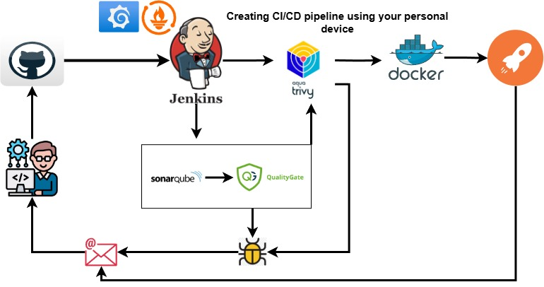
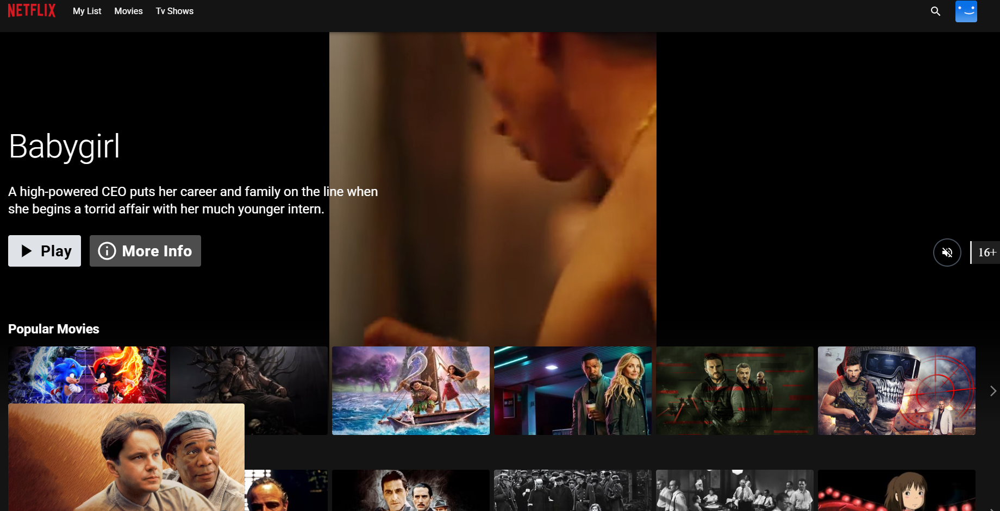
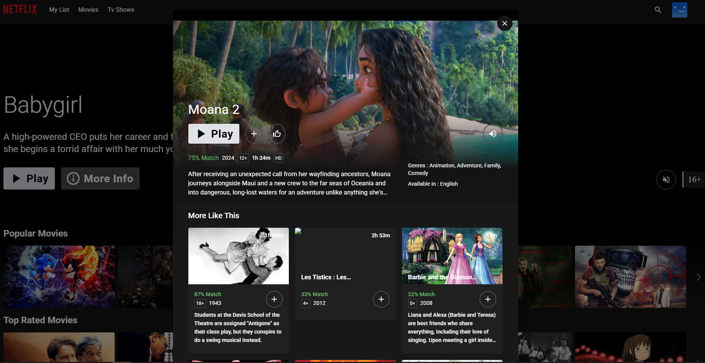

# StreamProject
DevOps practice using WSL or a VM on a personal device.

 
 <h1> Deploy a simple web application using a CI/CD pipeline on your personal device</h1>
  <h3>Disclaimer: The web application that will be deployed for this Stream Project is not owned by me.</h3>
  
  <h1> Home Page</h1>
  
  <h1>Netflix like Thumbnails</h1>
  

  
 This project is designed to initialize DevOps practices on a local computer or personal device, maximizing resources without relying on Amazon Web Services to avoid additional billing.  
    This project is dedicated to aspiring DevOps professionals who are unable to use T2.Large instances or additional storage on Amazon Web Services or Azure.
    The steps and processes for creating this CI/CD pipeline have been tested on AWS and follow the same procedure for Windows Subsystem for Linux (WSL) or VirtualBox.
   <h1>Project Highlight</h1>
    In this project, we will implement DevOps practices where Jenkins will pull source code from a GitHub repository and automate the process. We will use SonarQube for added security and pull the Quality Gate result before building the Docker image for the web application. Once the build is complete, we will scan the image using Aqua Trivy for additional security. If either the build or the Quality Gate result fails, an email notification will be sent to the developer, and the same will apply for Aqua Trivy results. If both the Quality Gate and Aqua Trivy scans pass, the Docker image will be deployed locally, and the developer will be notified of a successful deployment.
  

