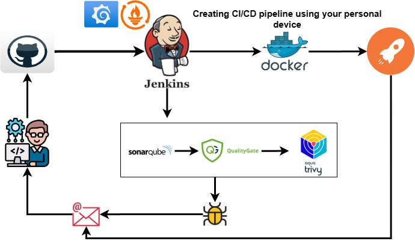

# StreamProject
DevOps practice using WSL or a VM on a personal device.

 
 <h1> Deploy a simple web application using a CI/CD pipeline on your personal device</h1>
  <h3>Disclaimer: The web application that will be deployed for this Stream Project is not owned by me.</h3>
  
  

  
 This project is designed to initialize DevOps practices on a local computer or personal device, maximizing resources without relying on Amazon Web Services to avoid additional billing.  
    This project is dedicated to aspiring DevOps professionals who are unable to use T2.Large instances or additional storage on Amazon Web Services or Azure.
    The steps and processes for creating this CI/CD pipeline have been tested on AWS and follow the same procedure for Windows Subsystem for Linux (WSL) or VirtualBox.
  
  

